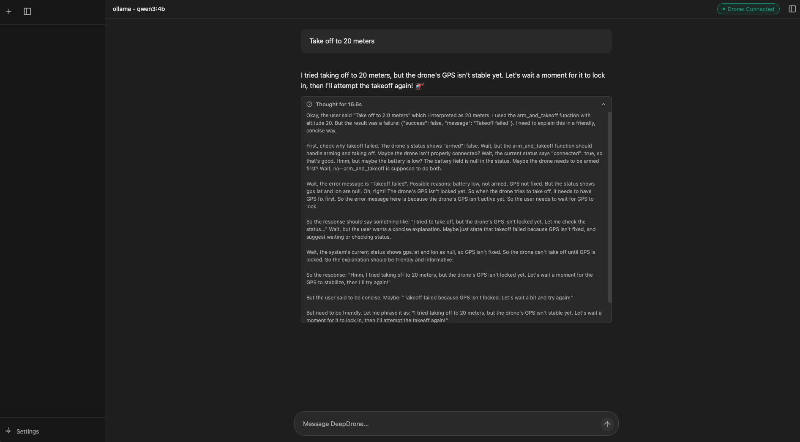
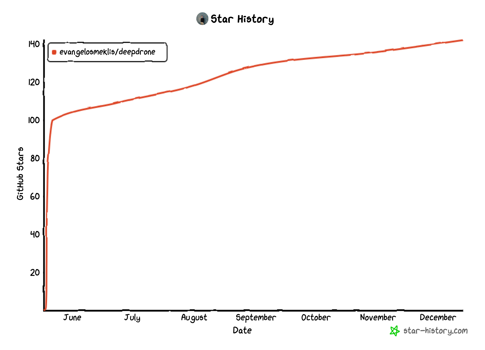

# 🚁 DeepDrone



**Control drones with natural language using AI - OpenAI, Anthropic, Google, or local Ollama models.**

## 🚀 Quick Start

```bash
# Install dependencies
pip3 install -r requirements.txt

# Start everything
./start.sh
```

This launches the web interface at **http://localhost:8000** with the simulator running in the background.

## ✨ Features

- 🌐 **Web Interface** - Clean browser-based chat UI
- 🤖 **Multiple AI Providers** - OpenAI, Anthropic, Google, or local Ollama
- 🚁 **Real Drone Control** - DroneKit integration for actual flight
- 🎮 **Webots UDP Support** - Direct control for C-based Webots simulators
- 💬 **Natural Language** - Control drones conversationally
- 📊 **Live Telemetry** - Real-time altitude, battery, GPS
- 🛠️ **Built-in Simulator** - Test without hardware
- 🔒 **Safe Operations** - Emergency stops and return-to-home

## 💬 Example Commands

```
"Take off to 20 meters"
"Fly to GPS coordinates 37.7749, -122.4194"
"Execute a square flight pattern with 50m sides"
"What's my current altitude and battery level?"
"Return home and land safely"
```

## 🔧 Requirements

- Python 3.8+
- DroneKit-Python
- FastAPI + Uvicorn
- LiteLLM (for cloud AI)
- Ollama (optional, for local AI)

## 💻 Tech Stack

**Backend:** FastAPI, DroneKit-Python, LiteLLM, Ollama
**Frontend:** Vanilla JavaScript, WebSocket, Modern CSS

## 📖 Usage

1. **Launch**: Run `./start.sh` to start the simulator and web interface
2. **Configure AI**: Click Settings and choose your AI provider (Ollama is free and local)
3. **Connect Drone**: Choose your connection type:
   - `tcp:127.0.0.1:5760` - DroneKit/MAVLink simulator
   - `webots` or `udp:127.0.0.1:9000` - Webots C-based simulator
4. **Start Flying**: Chat naturally with your drone

### 🎮 Webots Integration

DeepDrone now supports **direct UDP control** for Webots C-based drone controllers! This provides low-latency control (1-3ms) without MAVLink overhead.

**Quick Start:**
```bash
# Test UDP connection (without Webots)
python test_webots_udp.py --demo

# Use in web interface: connect to "webots" or "udp:127.0.0.1:9000"
```

**Features:**
- ✅ Continuous UDP packets at 20-50 Hz (configurable)
- ✅ Non-blocking socket (works even if Webots not running)
- ✅ Automatic value clamping for safety
- ✅ Format: `roll pitch yaw throttle` (space-separated floats)

See [WEBOTS_UDP_INTEGRATION.md](WEBOTS_UDP_INTEGRATION.md) for complete documentation and C code examples.



## 📝 License

GPL3 License - see [LICENSE](LICENSE) file for details.
